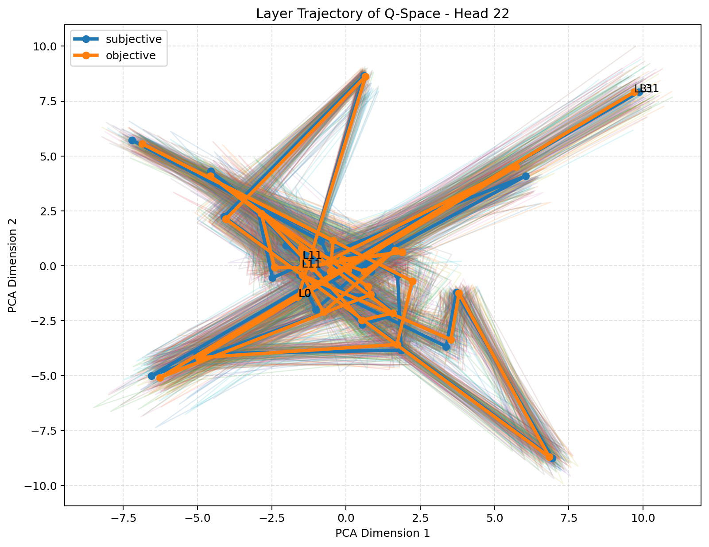
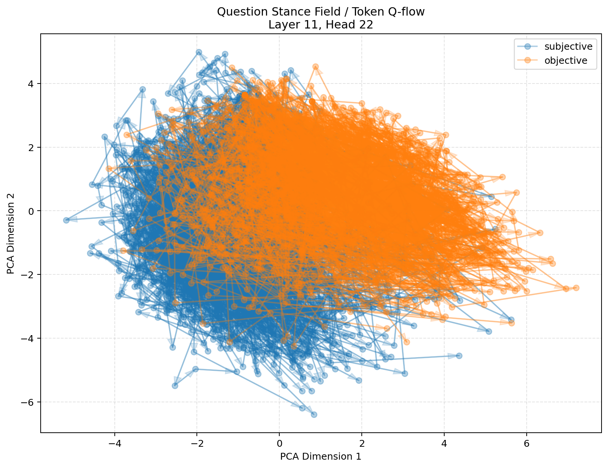

# Q-space Manifold

Exploratory tooling for probing the geometry of transformer Query vectors.

The central question is not only *what meaning is represented*, but how a model
forms a **stance for searching meaning**: which attention heads become sensitive
to sentiment, subjectivity, factual framing, or discourse posture, and how those
query directions evolve across layers and tokens.

This repository currently contains a self-contained monolithic probe:

```text
q_space_manifold_monolith.py
```

It extracts per-layer/per-head Q vectors, compares head and layer separation,
projects Q-space with PCA or UMAP, traces token-level Q-flow, and runs early
controls such as random-label baselines, projection diagnostics, linear probes,
and head-to-head RSA/CKA.

## Current Hypothesis

Early results suggest that middle transformer layers may contain a phase where
question or discourse stance becomes sharply organized:

- **stance formation**: subjective, objective, positive, negative, or factual
  framing becomes separable in Q-space;
- **query routing**: specific heads appear to define attractor-like routing
  directions for what the next attention operation will seek;
- **discourse framing**: token-level Q-flow often looks less like a random walk
  and more like a structured path from initialization into local exploration and
  drift.

This is still exploratory. The current evidence is correlational, not causal.
Causal ablation and post-RoPE Q capture are planned follow-ups.

## What Is Being Measured?

For GPT-2-style models, the script captures the Q slice from fused QKV
projection layers such as `c_attn`.

For Llama/Mistral/Gemma-style RoPE models, the script captures the output of
`q_proj` / `wq`. This means the default measurement is:

```text
pre-RoPE Q projection output
```

That is intentional for the current probe: it emphasizes the content-dependent
query direction before rotary positional phase is applied. Metadata and plot
titles now record this as `q_capture_stage:
q_projection_output_pre_attention_position_rotation`.

Interpretation:

```text
pre-RoPE Q  = content / stance routing vector
post-RoPE Q = content + positional phase query used for attention scoring
```

## Representative Run

The current representative scan used:

- dataset: `SetFit/subj`
- split: `train`
- samples: `100 subjective + 100 objective`
- model: `mlx-community/Mistral-7B-Instruct-v0.3-4bit`
- backend: MLX
- projection: PCA
- target depth: `round(0.35 * (n_layers - 1)) = layer 11`

Summary:

```text
best layer/head: layer 11, head 22
relative depth: 0.3548
silhouette cosine: 0.2290
linear probe leave-one-out accuracy:
  target L11/H4  = 0.84
  best   L11/H22 = 0.86
random-label p-value: 0.0099
```

### Layer x Head Separability


### Head Manifolds at Layer 11


### Layer Trajectory for the Best Head



### Token-Level Q-Flow



### Head Similarity: CKA and RSA

These matrices ask whether strong heads are redundant copies or distinct axes.


## Quick Start

### Torch backend

```bash
python3 -m venv .venv
source .venv/bin/activate
pip install -r requirements.txt

python q_space_manifold_monolith.py \
  --backend torch \
  --model-path gpt2 \
  --target-layer 6 \
  --target-head 3 \
  --projection pca \
  --output-dir /tmp/q_space_gpt2_probe
```

### MLX backend

On Apple Silicon:

```bash
python3 -m venv .venv
source .venv/bin/activate
pip install -r requirements-mlx.txt

python q_space_manifold_monolith.py \
  --backend mlx \
  --model-path mlx-community/Mistral-7B-Instruct-v0.3-4bit \
  --dataset-source subj \
  --dataset-split train \
  --samples-per-class 100 \
  --target-layer-fraction 0.35 \
  --target-head 4 \
  --projection pca \
  --detail-best-layer-head \
  --label-permutation-n 100 \
  --high-d-flow-metrics \
  --projection-diagnostics \
  --probe-linear \
  --head-similarity \
  --drop-special-tokens \
  --flow-start-token-index 1 \
  --output-dir /tmp/q_space_phase_scan_subj
```

## Cross-Model Phase Scan

Use `--batch-models` to compare models with the same dataset and metrics.

```bash
python q_space_manifold_monolith.py \
  --dataset-source subj \
  --dataset-split train \
  --samples-per-class 100 \
  --batch-models \
mistral_it=mlx:mlx-community/Mistral-7B-Instruct-v0.3-4bit,llama3_it=mlx:mlx-community/Meta-Llama-3-8B-Instruct-4bit,gemma2_2b_it=mlx:mlx-community/gemma-2-2b-it-4bit \
  --target-layer-fraction 0.35 \
  --target-head 4 \
  --projection pca \
  --detail-best-layer-head \
  --label-permutation-n 100 \
  --high-d-flow-metrics \
  --projection-diagnostics \
  --probe-linear \
  --head-similarity \
  --drop-special-tokens \
  --flow-start-token-index 1 \
  --output-dir /tmp/q_space_phase_scan_subj_3models
```

Batch outputs:

```text
batch_model_summary.csv
batch_top_layer_heads.csv
batch_manifest.json
```

The main comparison field is `best_layer_relative_depth`, which allows models
with different layer counts to be compared on the same normalized axis.

## Pooling Robustness

`pool_last_k=1` measures the final token's Q vector. For questions, this is
often the `?` token; for SST-2/SUBJ declarative sentences, it is often a final
punctuation token. To test whether the effect is robust to this choice:

```bash
python q_space_manifold_monolith.py \
  --backend mlx \
  --model-path mlx-community/Mistral-7B-Instruct-v0.3-4bit \
  --dataset-source subj \
  --samples-per-class 100 \
  --target-layer-fraction 0.35 \
  --target-head 4 \
  --pool-last-k-sweep 1,3,5 \
  --projection pca \
  --detail-best-layer-head \
  --head-similarity \
  --no-plots \
  --output-dir /tmp/q_space_pool_sweep
```

The sweep reuses captured token Q tensors per model and writes:

```text
pool_last_k_sweep_summary.csv
pool_last_k_sweep_manifest.json
```

## Outputs

Each run writes:

```text
q_space_vectors.npz
run_metadata.json
analysis_summary.json
dataset_rows.csv
head_scores.csv
layer_head_scores.csv
layer_head_separability_heatmap.png
token_flow_metrics_layer_L_head_H.csv
token_flow_meta_layer_L_head_H.csv
```

Optional outputs:

```text
label_permutation_summary.csv
linear_probe_summary.csv
projection_diagnostics.csv
highd_token_flow_metrics_layer_L_head_H.csv
head_cka_matrix_layer_L.csv
head_rsa_matrix_layer_L.csv
head_similarity_pairs_layer_L.csv
head_cka_heatmap_layer_L.png
head_rsa_heatmap_layer_L.png
```

## Near-Term Research Directions

- compare Mistral, Llama, and Gemma at matched relative depths;
- compare base vs instruction-tuned checkpoints;
- run SST-2 and SUBJ with `pool_last_k` sweeps;
- inspect whether strong heads are redundant via RSA/CKA;
- implement post-RoPE Q capture as an option;
- add causal ablation of candidate heads and measure downstream degradation.

## Caveats

- The current strongest evidence is geometric and predictive, not causal.
- Linear probes can be over-optimistic when sample counts are small.
- PCA/UMAP are visualizations; silhouette is computed in the original Q-space.
- Flow-field curl/divergence summaries are exploratory 2D projection summaries,
  not physical quantities in the original high-dimensional space.
