# Q-space Manifold

Exploratory tooling for probing the geometry of transformer Query vectors.

The central question is not only *what meaning is represented*, but how a model
forms a **stance for searching meaning**: which attention heads become sensitive
to sentiment, subjectivity, factual framing, or discourse posture, and how those
query directions evolve across layers and tokens. Recent runs also test whether
code-language identity appears as a different kind of late query readout.

This repository currently contains a self-contained monolithic probe:

```text
q_space_manifold_monolith.py
```

It extracts per-layer/per-head Q vectors, compares head and layer separation,
projects Q-space with PCA or UMAP, traces token-level Q-flow, and runs early
controls such as random-label baselines, projection diagnostics, linear probes,
and head-to-head RSA/CKA.

## Current Hypothesis

Early results suggest that some transformer heads or local head bands may expose
**stance-sensitive Q-space geometry** under this probe. The location and
localization of that geometry appear sensitive to model family, tuning state,
task framing, token pooling, and pre/post-RoPE capture stage:

- **stance formation**: subjective, objective, positive, negative, or factual
  framing becomes separable in Q-space;
- **query routing**: local head bands can define attractor-like routing
  directions for what the next attention operation will seek;
- **discourse framing**: token-level Q-flow often looks less like a random walk
  and more like a structured path from initialization into local exploration and
  drift;
- **code-language routing**: code snippets expose a later, pooled-tail readout
  that differs from the earlier natural-language stance probes.

The current working hypothesis is:

```text
decoder-only transformers can show task-conditioned Q-space readout bands,
including stance-separating and code-routing geometries, but the measured band
may move or diffuse with architecture, instruction tuning, prompt framing,
token readout, and RoPE capture stage.
```

This is still exploratory. The current evidence is geometric and predictive,
not causal. Specific-head identities should be treated as candidate readouts of
a local band, not as stable mechanistic units yet. Post-RoPE Q capture is now
supported for MLX RoPE models; causal ablation remains a planned follow-up.

## Research Notes

- [Cross-benchmark Q-space patterns](docs/research_notes/cross_benchmark_patterns.md):
  a synthesis across SUBJ, prompted SST-2, TREC, and CodeXGLUE. The current
  reading is that task-conditioned Q-space readouts recur, but their depth,
  pooling behavior, and head localization depend on the task and model family.
- [N=1000/class 3D base-vs-instruct matrix](docs/research_notes/n1000_3d_matrix.md):
  the first medium-scale 6-model pass across SUBJ and prompted SST-2, now with
  pre/post-RoPE headline comparisons. SUBJ preserves the Mistral/Llama/Gemma
  family split, while prompted SST-2 shows strong instruction-tuned
  sentiment-query heads in Mistral and Llama 3.
- [TREC question-type pre/post-RoPE sweep](docs/research_notes/trec_question_type_pre_post_rope.md):
  a six-model pass over coarse question categories. TREC shows a weaker
  six-way manifold silhouette than SUBJ, but answer-type routing is strongly
  linearly readable from final-token Q vectors. The headline TREC readouts are
  largely stable across pre/post-RoPE in this single seed: Mistral base/IT recur
  at the same L17/H26 head, Llama rows also survive, and Gemma 2 2B-it remains
  weakly localized.
- [CodeXGLUE code-language pre/post-RoPE sweep](docs/research_notes/codexglue_code_language_pre_post_rope_n1000.md):
  a six-model 4bit pass over six CodeSearchNet language classes. Code-language
  identity appears as a late, pooling-amplified readout across model families:
  Mistral recurs at L21/H18, Llama 3 at L19/H30, and Gemma 2 2B remains weaker
  and more diffuse. The readout is largely stable across pre/post-RoPE in
  Mistral and Llama 3.
- [Pre/post-RoPE SUBJ pilot](docs/research_notes/pre_post_rope_subj_pilot.md):
  an initial Mistral-IT check where stance separation survives after RoPE. Its
  "weaker, broader, later" wording is now treated as pilot-specific rather than
  a cross-family headline.
- [Related-work survey](docs/research_notes/related_work_survey.md):
  a short positioning note around layer probing, head specialization,
  fine-tuning representation geometry, and RoPE.
- [Base vs instruction-tuned SUBJ scan](docs/research_notes/base_vs_instruct_subj.md):
  Mistral appears stable, Llama 3 migrates deeper, and Gemma 2 2B flattens or
  diffuses its single-head Q-space stance axis after instruction tuning.
- [SST-2 pool-last-k sweep](docs/research_notes/sst2_pool_last_k_sweep.md):
  sentiment polarity is weaker than SUBJ subjectivity/objectivity in single-head
  Q-space, but the signal does not disappear when pooling over the last `1,3,5`
  tokens.
- [SST-2 base-vs-instruct and prompt framing](docs/research_notes/sst2_base_vs_prompted.md):
  naked SST-2 stays weak, but `Review: {text}\nSentiment:` strongly lights up
  late sentiment-query heads in Mistral and Llama 3.

For moving the work to another machine or fresh thread, see
[MBP dense follow-up handoff](docs/handoff/mbp_dense_followup.md). A compact
machine-readable companion is available as
`docs/handoff/mbp_dense_followup.jsonl`.

## What Is Being Measured?

For GPT-2-style models, the script captures the Q slice from fused QKV
projection layers such as `c_attn`.

For Llama/Mistral/Gemma-style RoPE models, the script captures the output of
`q_proj` / `wq`. This means the default measurement is:

```text
pre-RoPE Q projection output
```

That is intentional for the current probe: it emphasizes the content-dependent
query direction before rotary positional phase is applied. Metadata and plot
titles now record this as `q_capture_stage:
q_projection_output_pre_attention_position_rotation`.

Interpretation:

```text
pre-RoPE Q  = content / stance routing vector
post-RoPE Q = content + positional phase query used for attention scoring
```

To capture RoPE-applied Q vectors instead, use:

```bash
--q-capture-stage post-rope
```

The current post-RoPE implementation supports MLX RoPE models and captures the
query tensor from the model's actual RoPE call before attention scaling/scoring.
This makes pre/post comparison an explicit experimental axis:

```text
pre-RoPE  = stance routing before positional rotation
post-RoPE = stance routing after positional phase is applied
```

## Representative Run

The current representative scan used:

- dataset: `SetFit/subj`
- split: `train`
- samples: `100 subjective + 100 objective`
- model: `mlx-community/Mistral-7B-Instruct-v0.3-4bit`
- backend: MLX
- projection: PCA
- target depth: `round(0.35 * (n_layers - 1)) = layer 11`

`--target-layer-fraction 0.35` is a convenience anchor for comparable first-look
plots near the early/middle depth. It is not used as evidence for the final
claim by itself: the reported best rows come from the full layer x head
silhouette scan, and `--detail-best-layer-head` adds that discovered row to the
detailed diagnostics.

Summary:

```text
best layer/head: layer 11, head 22
relative depth: 0.3548
silhouette cosine: 0.2290
linear probe leave-one-out accuracy:
  target L11/H4  = 0.84
  best   L11/H22 = 0.86
random-label p-value: 0.0099
```

## First Cross-Model SUBJ Scan

A first 3-model scan used the same `SetFit/subj` sample
(`100 subjective + 100 objective`) and the same PCA / random-label /
linear-probe settings across:

- `mlx-community/Mistral-7B-Instruct-v0.3-4bit`
- `mlx-community/Meta-Llama-3-8B-Instruct-4bit`
- `mlx-community/gemma-2-2b-it-4bit`

Best layer/head by high-dimensional cosine silhouette:

| model | best layer/head | relative depth | silhouette |
| --- | ---: | ---: | ---: |
| Mistral-7B-Instruct | L11/H22 | 0.355 | 0.2290 |
| Llama-3-8B-Instruct | L20/H31 | 0.645 | 0.2276 |
| Gemma-2-2B-it | L12/H1 | 0.480 | 0.0410 |

Interpretation:

- **Mistral** shows a broad early/mid stance-separation band, with several
  top heads between relative depth `0.23` and `0.58`.
- **Llama 3** reaches a similar maximum silhouette, but its strongest head is
  later, around relative depth `0.65`, with several secondary heads in the
  mid-to-late range.
- **Gemma 2 2B** is much weaker as a single-head Q-space separation signal:
  its top 10 heads stay near `0.03-0.04`. However, linear probes still perform
  above random-label controls, suggesting weak or distributed signal rather
  than total absence.

Linear probe leave-one-out accuracy for the best overall head:

| model | best head | LOO accuracy | random-label mean |
| --- | ---: | ---: | ---: |
| Mistral-7B-Instruct | L11/H22 | 0.86 | 0.487 |
| Llama-3-8B-Instruct | L20/H31 | 0.935 | 0.497 |
| Gemma-2-2B-it | L12/H1 | 0.64 | 0.494 |

This updates the hypothesis from "a generic middle-layer phase" to a more
specific one:

```text
Mistral-like architectures may expose an earlier concentrated Q-space stance
phase, Llama 3 may expose a later concentrated phase, and smaller Gemma models
may express the signal more weakly or more diffusely.
```

The raw summary files are in `examples/subj_3models/`.

## Medium-Scale 3D Matrix

The first larger pass uses `1000` samples per class and 3D plot downsampling
across six base/instruction-tuned 4bit configurations:

```text
Mistral-7B base / instruct
Llama-3-8B base / instruct
Gemma-2-2B base / instruct
```

Compact tracked summaries are in `examples/n1000_3d_matrix/`; the full plot and
vector artifacts are left under `/tmp`.

SUBJ best layer/head:

| model | best layer/head | silhouette |
| --- | ---: | ---: |
| Mistral-7B base | L10/H6 | 0.2270 |
| Mistral-7B instruct | L7/H15 | 0.2154 |
| Llama-3-8B base | L11/H6 | 0.1758 |
| Llama-3-8B instruct | L20/H31 | 0.2187 |
| Gemma-2-2B base | L21/H4 | 0.1663 |
| Gemma-2-2B-it | L1/H0 | 0.0345 |

Prompted SST-2 strongest row by model across `pool_last_k=1,3,5`:

| model | strongest row | silhouette |
| --- | ---: | ---: |
| Mistral-7B base | k=5 L10/H21 | 0.0978 |
| Mistral-7B instruct | k=1 L23/H30 | 0.1726 |
| Llama-3-8B base | k=1 L20/H24 | 0.1205 |
| Llama-3-8B instruct | k=1 L18/H28 | 0.2246 |
| Gemma-2-2B base | k=5 L12/H4 | 0.0587 |
| Gemma-2-2B-it | k=5 L12/H3 | 0.0266 |

Post-RoPE reruns keep the main structure at headline level, but small
pre/post-RoPE differences should be treated as single-run variation until
reproduced. Mistral base keeps `L10/H6` on SUBJ, Llama3-IT keeps its late
`L20/H31` SUBJ readout and `L18/H28` prompted SST-2 readout, and Gemma2-2B-it
remains weakly localized.


This turns the working hypothesis into a 12-cell comparison:

```text
3 model families x 2 tuning states x 2 task framings
```

The next planned version repeats the same matrix with dense same-family
checkpoints on a larger MacBook Pro to separate architecture/tuning effects from
4bit quantization effects.

## Head Similarity: Specialization vs Redundancy

The next diagnostic asks whether the best stance-separating heads are isolated
axes, semi-specialized clusters, or mostly redundant with the rest of the layer.
For each model's best layer, the probe computes pairwise linear CKA and RSA
correlation over head-level Q-space geometry.

| model | best head | mean off-diagonal CKA | mean off-diagonal RSA | nearest heads by CKA |
| --- | ---: | ---: | ---: | --- |
| Mistral-7B-Instruct | L11/H22 | 0.577 | 0.638 | H19, H23, H20 |
| Llama-3-8B-Instruct | L20/H31 | 0.655 | 0.772 | H30, H20, H23 |
| Gemma-2-2B-it | L12/H1 | 0.804 | 0.877 | H3, H0, H5 |

Interpretation:

- **Mistral** looks like an early/mid semi-specialized stance cluster: H22 is
  not isolated, but the layer still has enough head diversity for a few heads
  to form a clear subjectivity/objectivity axis.
- **Llama 3** looks like a later semi-specialized stance cluster: the best head
  appears in a more redundant late-layer neighborhood, but still separates SUBJ
  about as strongly as Mistral.
- **Gemma 2 2B** has weak single-head Q-space geometry and high head
  redundancy. The signal is not absent, but it appears less localized to a
  distinct head and is more plausibly distributed across similar heads.

Representative head-similarity pair tables are included in
`examples/subj_3models/`.

Llama 3 best-layer CKA/RSA:

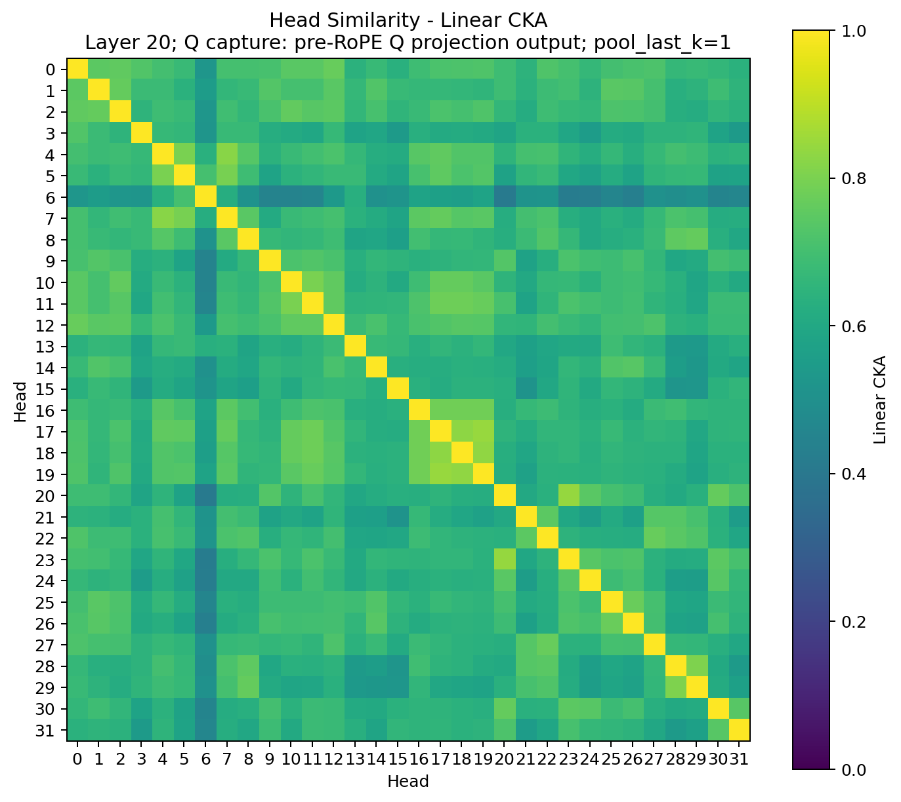

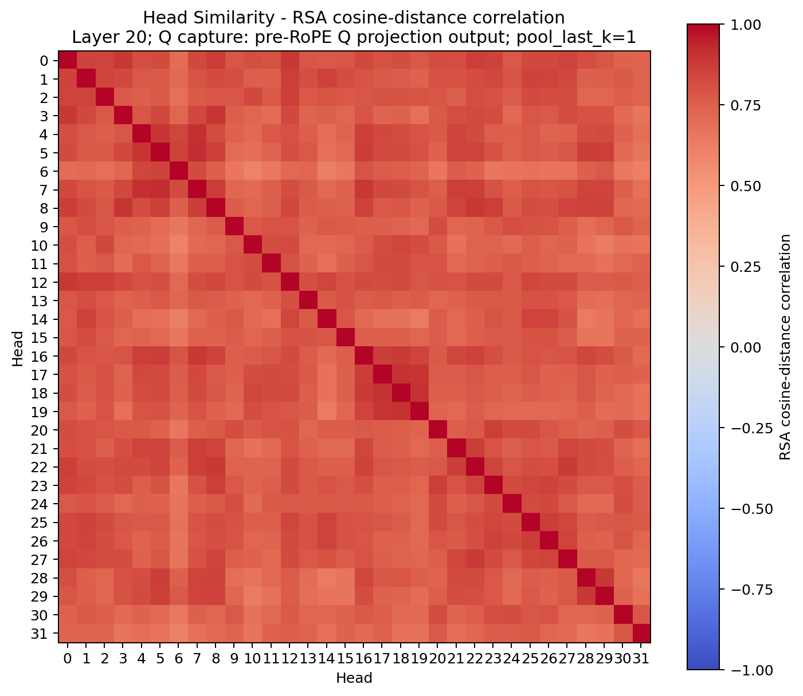

Gemma 2 2B best-layer CKA/RSA:

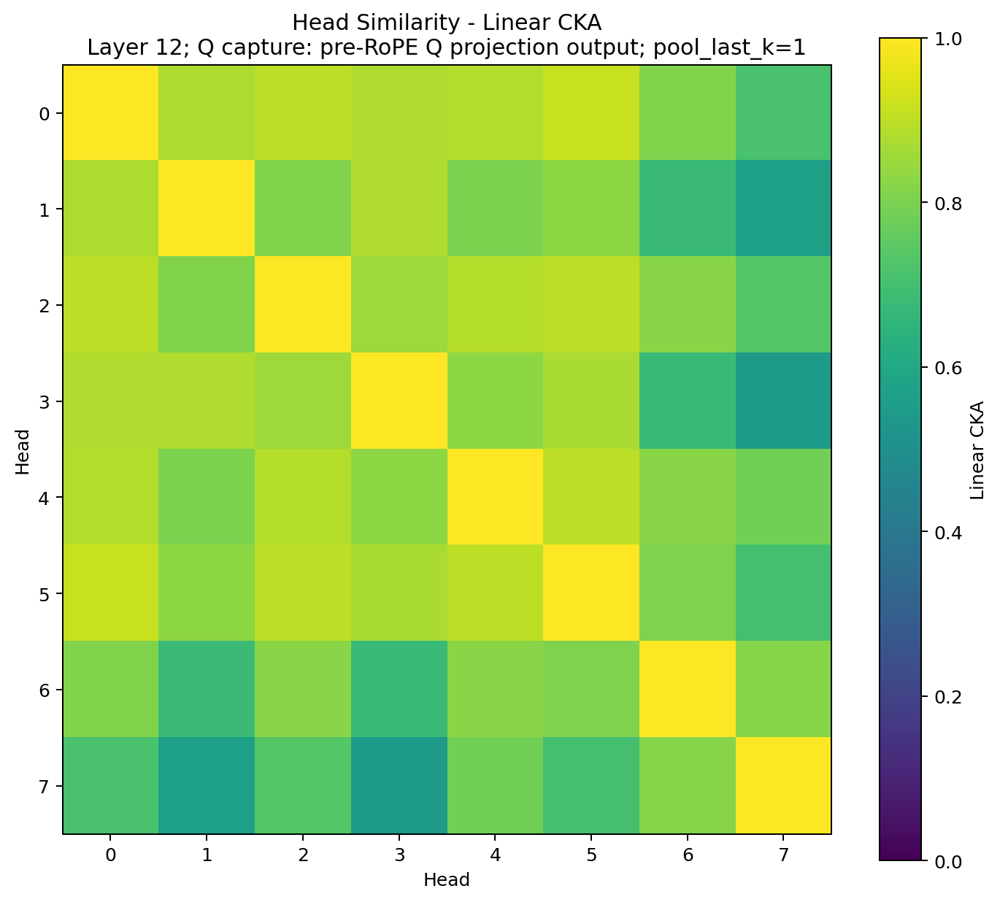

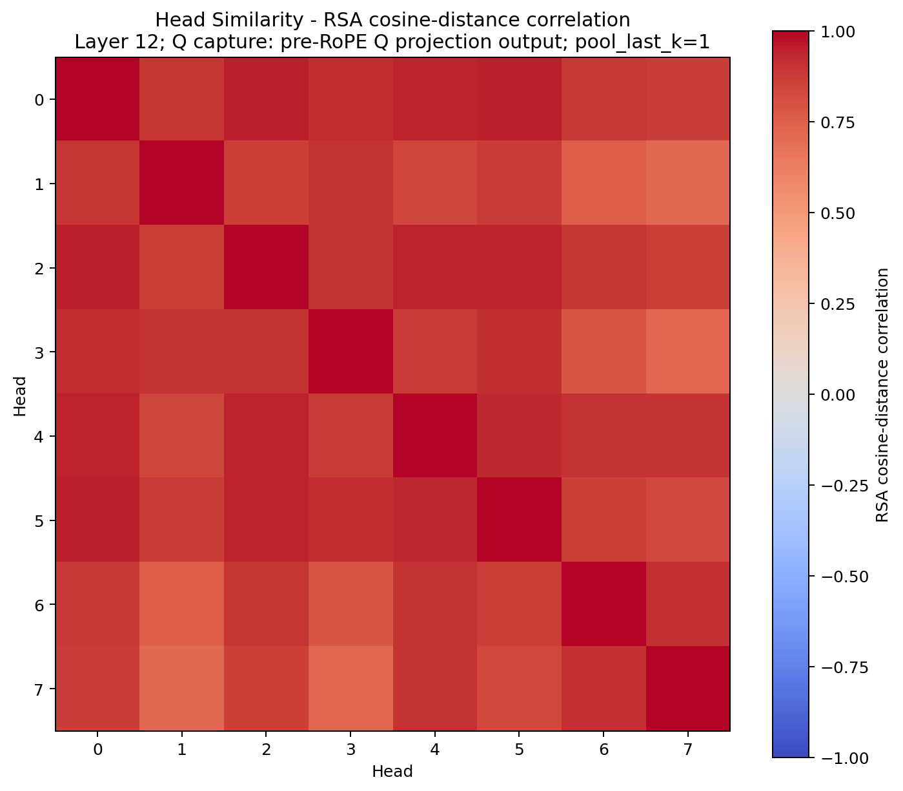

### Mistral vs Llama vs Gemma Heatmaps

Mistral:

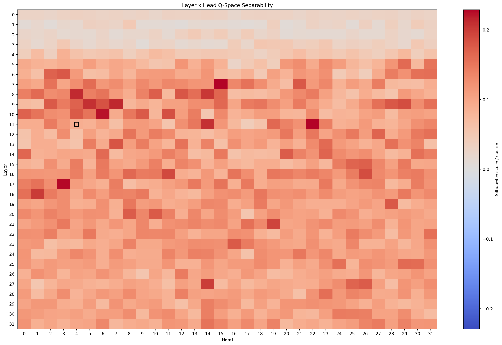

Llama 3:

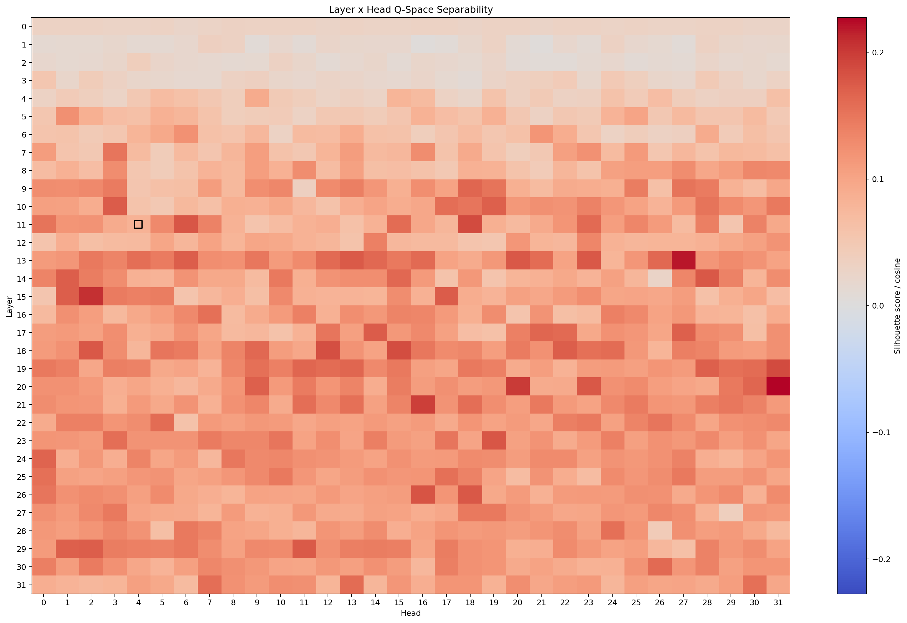

Gemma 2 2B:

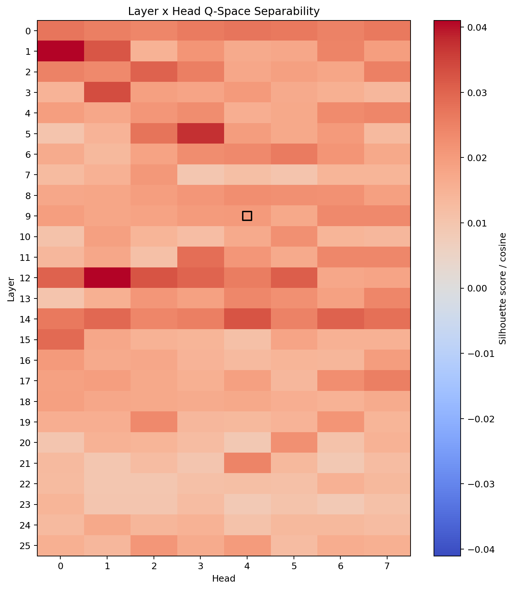

## Representative Mistral Detail Plots

### Layer x Head Separability


### Head Manifolds at Layer 11

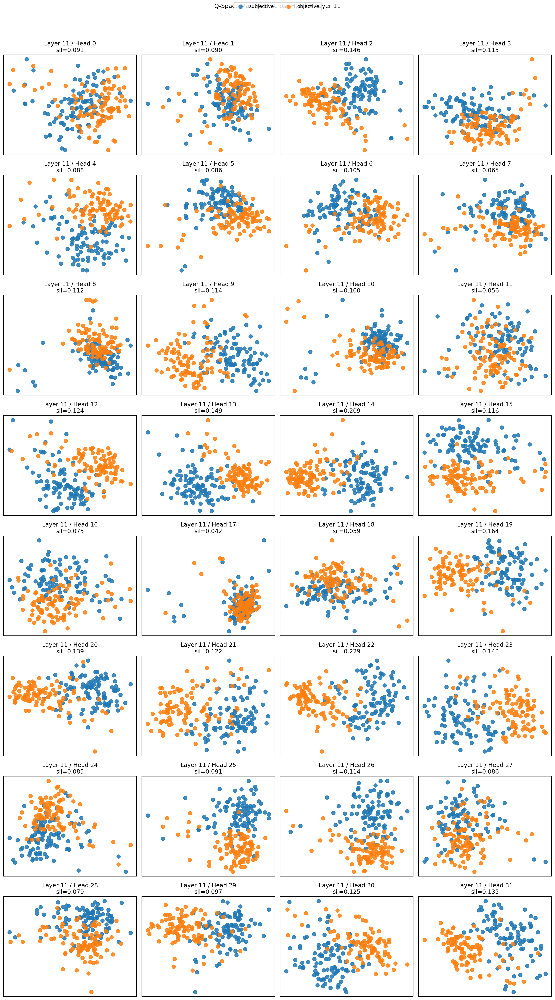

### 3D Layer Trajectory for the Best Head

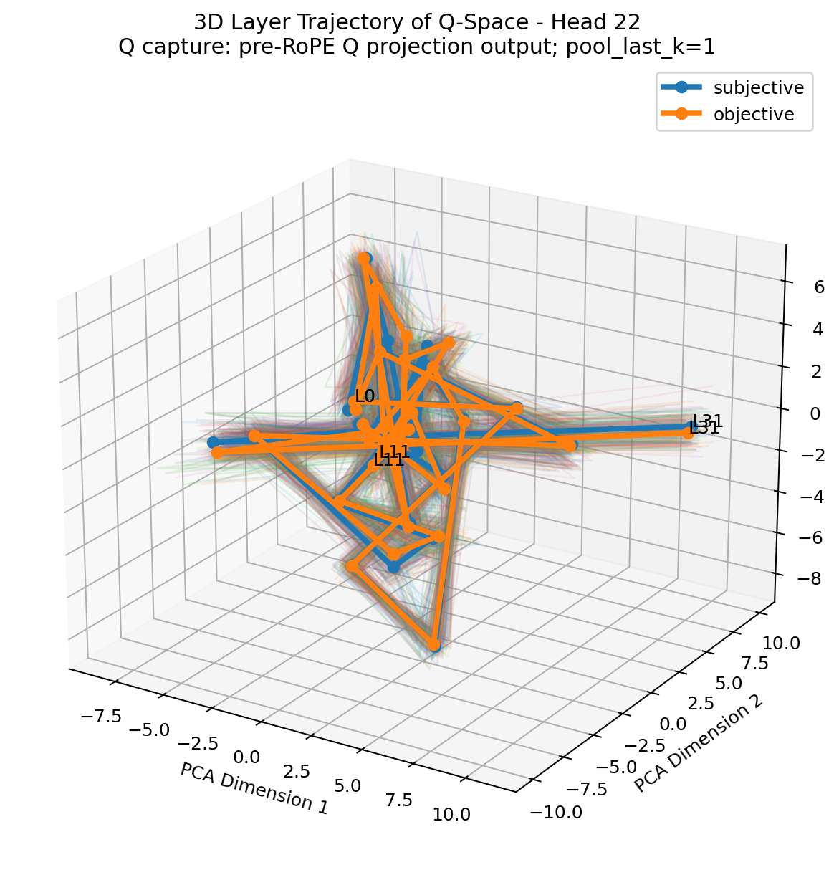

### 3D Token-Level Q-Flow

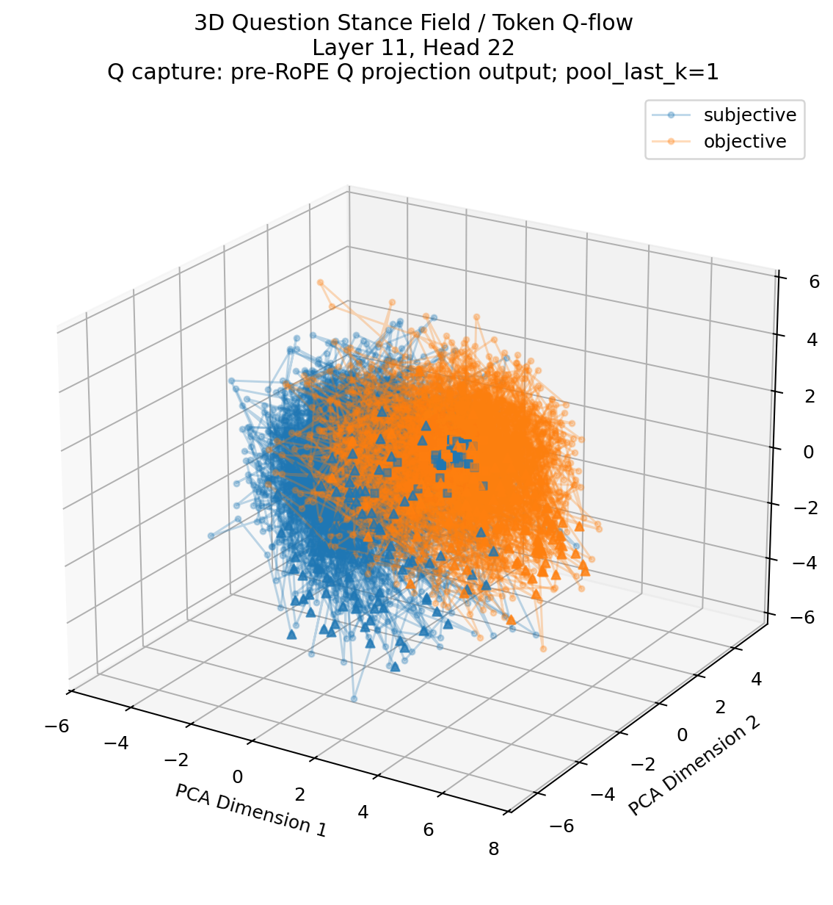

### Head Similarity: CKA and RSA

These matrices ask whether strong heads are redundant copies or distinct axes.

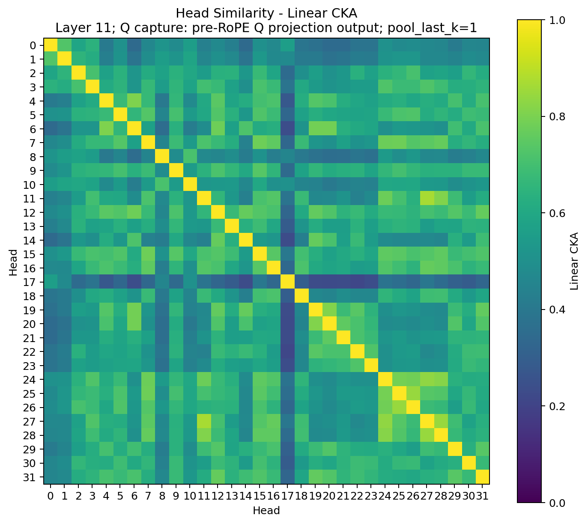

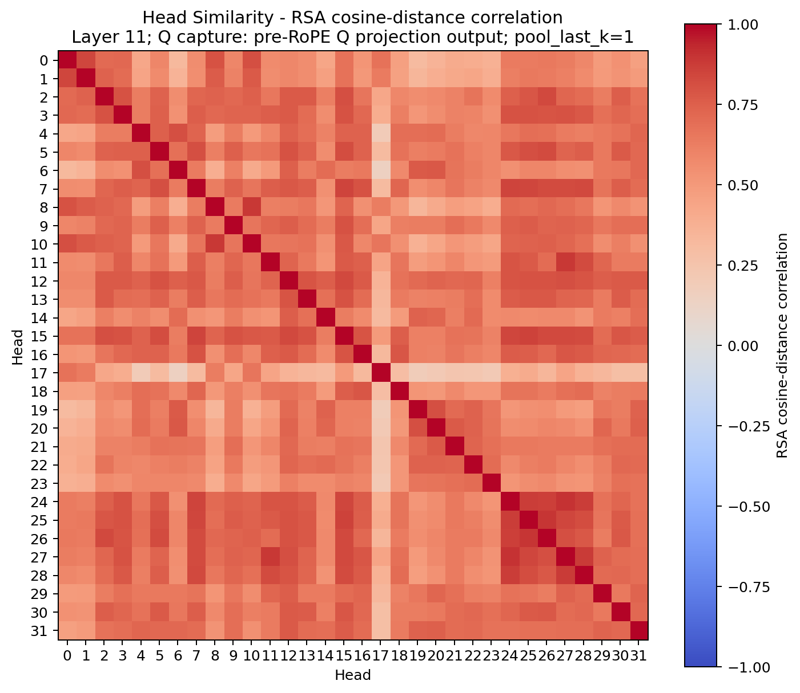

## Quick Start

### Torch backend

```bash
python3 -m venv .venv
source .venv/bin/activate
pip install -r requirements.txt

python q_space_manifold_monolith.py \
  --backend torch \
  --model-path gpt2 \
  --target-layer 6 \
  --target-head 3 \
  --projection pca \
  --output-dir /tmp/q_space_gpt2_probe
```

### MLX backend

On Apple Silicon:

```bash
python3 -m venv .venv
source .venv/bin/activate
pip install -r requirements-mlx.txt

python q_space_manifold_monolith.py \
  --backend mlx \
  --model-path mlx-community/Mistral-7B-Instruct-v0.3-4bit \
  --dataset-source subj \
  --dataset-split train \
  --samples-per-class 100 \
  --target-layer-fraction 0.35 \
  --target-head 4 \
  --q-capture-stage pre-rope \
  --projection pca \
  --detail-best-layer-head \
  --label-permutation-n 100 \
  --high-d-flow-metrics \
  --projection-diagnostics \
  --probe-linear \
  --head-similarity \
  --drop-special-tokens \
  --flow-start-token-index 1 \
  --output-dir /tmp/q_space_phase_scan_subj
```

For larger runs, keep the metrics on the full sample but make the plots readable
with plot-only downsampling and optional 3D views:

```bash
python q_space_manifold_monolith.py \
  --backend mlx \
  --model-path mlx-community/Mistral-7B-Instruct-v0.3-4bit \
  --dataset-source subj \
  --samples-per-class 1000 \
  --target-layer-fraction 0.35 \
  --target-head 4 \
  --projection pca \
  --detail-best-layer-head \
  --plot-3d \
  --plot-sample-limit 200 \
  --drop-special-tokens \
  --flow-start-token-index 1 \
  --output-dir /tmp/q_space_subj_n1000_plots
```

`--plot-sample-limit` affects only all-sample trajectory and token-flow plots;
CSV metrics, silhouettes, probes, and summaries still use the full captured
dataset.

To rerun the same probe after rotary position embedding:

```bash
python q_space_manifold_monolith.py \
  --backend mlx \
  --model-path mlx-community/Mistral-7B-Instruct-v0.3-4bit \
  --dataset-source subj \
  --samples-per-class 1000 \
  --target-layer-fraction 0.35 \
  --target-head 4 \
  --q-capture-stage post-rope \
  --projection pca \
  --detail-best-layer-head \
  --plot-3d \
  --plot-sample-limit 200 \
  --drop-special-tokens \
  --flow-start-token-index 1 \
  --output-dir /tmp/q_space_subj_n1000_post_rope
```

## Cross-Model Phase Scan

Use `--batch-models` to compare models with the same dataset and metrics.

```bash
python q_space_manifold_monolith.py \
  --dataset-source subj \
  --dataset-split train \
  --samples-per-class 100 \
  --batch-models \
mistral_it=mlx:mlx-community/Mistral-7B-Instruct-v0.3-4bit,llama3_it=mlx:mlx-community/Meta-Llama-3-8B-Instruct-4bit,gemma2_2b_it=mlx:mlx-community/gemma-2-2b-it-4bit \
  --target-layer-fraction 0.35 \
  --target-head 4 \
  --projection pca \
  --detail-best-layer-head \
  --label-permutation-n 100 \
  --high-d-flow-metrics \
  --projection-diagnostics \
  --probe-linear \
  --head-similarity \
  --drop-special-tokens \
  --flow-start-token-index 1 \
  --output-dir /tmp/q_space_phase_scan_subj_3models
```

Batch outputs:

```text
batch_model_summary.csv
batch_top_layer_heads.csv
batch_manifest.json
```

The main comparison field is `best_layer_relative_depth`, which allows models
with different layer counts to be compared on the same normalized axis.

## Pooling Robustness

`pool_last_k=1` measures the final token's Q vector. For questions, this is
often the `?` token; for SST-2/SUBJ declarative sentences, it is often a final
punctuation token. To test whether the effect is robust to this choice:

```bash
python q_space_manifold_monolith.py \
  --backend mlx \
  --model-path mlx-community/Mistral-7B-Instruct-v0.3-4bit \
  --dataset-source subj \
  --samples-per-class 100 \
  --target-layer-fraction 0.35 \
  --target-head 4 \
  --pool-last-k-sweep 1,3,5 \
  --projection pca \
  --detail-best-layer-head \
  --head-similarity \
  --no-plots \
  --output-dir /tmp/q_space_pool_sweep
```

The sweep reuses captured token Q tensors per model and writes:

```text
pool_last_k_sweep_summary.csv
pool_last_k_sweep_manifest.json
```

For long multi-model sweeps, add `--resume-existing`. Completed
`pool_last_k/model` directories with `analysis_summary.json` are skipped, and
the sweep summary is rebuilt incrementally. This is useful when a large run is
interrupted after one or more model captures have already finished.

To test a task framing rather than the naked sentence, use `--text-template`:

```bash
python q_space_manifold_monolith.py \
  --backend mlx \
  --model-path mlx-community/Mistral-7B-Instruct-v0.3-4bit \
  --dataset-source sst2 \
  --samples-per-class 100 \
  --text-template $'Review: {text}\nSentiment:' \
  --pool-last-k-sweep 1,3,5 \
  --projection pca \
  --detail-best-layer-head \
  --head-similarity \
  --no-plots \
  --output-dir /tmp/q_space_prompted_sst2
```

## Outputs

Each run writes:

```text
q_space_vectors.npz
run_metadata.json
analysis_summary.json
dataset_rows.csv
head_scores.csv
layer_head_scores.csv
layer_head_separability_heatmap.png
token_flow_metrics_layer_L_head_H.csv
token_flow_meta_layer_L_head_H.csv
```

Optional outputs:

```text
label_permutation_summary.csv
top_layer_head_label_permutation_summary.csv
linear_probe_summary.csv
projection_diagnostics.csv
highd_token_flow_metrics_layer_L_head_H.csv
head_cka_matrix_layer_L.csv
head_rsa_matrix_layer_L.csv
head_similarity_pairs_layer_L.csv
head_cka_heatmap_layer_L.png
head_rsa_heatmap_layer_L.png
layer_trajectory_3d_head_H_focus_layer_L.png
query_flow_3d_layer_L_head_H_all.png
```

## Near-Term Research Directions

- repeat the 12-cell SUBJ / prompted-SST-2 matrix on dense same-family
  checkpoints;
- compare pre-RoPE and post-RoPE Q capture on the strongest 4bit heads before
  treating the dense run as a final architecture check;
- compare Q-space against K-space and V-space scans to determine whether weak
  Gemma localization is Q-specific or representation-wide;
- add a two-class silhouette ceiling sanity check so SUBJ scores can be
  interpreted against an empirical upper bound;
- test whether Gemma's weaker single-head signal becomes stronger in 9B or
  appears as a multi-head / multi-layer distributed code;
- add causal ablation of candidate heads and measure downstream degradation.

## Caveats

- The current strongest evidence is geometric and predictive, not causal.
- Prompted SST-2 is confounded with prompt following and instruction-format
  competence; it should not yet be read as generic sentiment representation.
- Linear probes can be over-optimistic when sample counts are small.
- PCA/UMAP are visualizations; silhouette is computed in the original Q-space.
- Random-label silhouette null statistics should accompany final headline
  tables. `batch_model_summary.csv` and `batch_top_layer_heads.csv` include
  these columns when `--label-permutation-n` is positive.
- Flow-field curl/divergence summaries are exploratory 2D projection summaries,
  not physical quantities in the original high-dimensional space.
