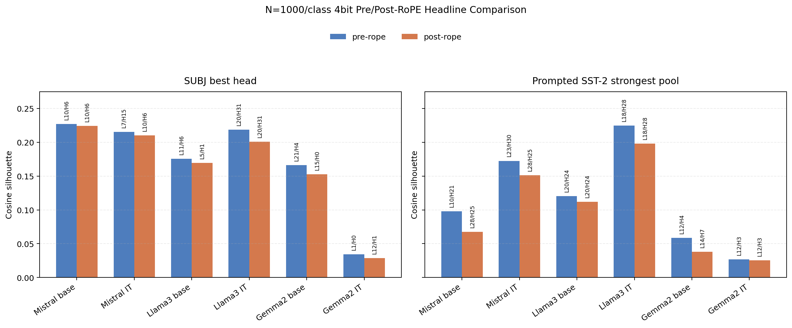
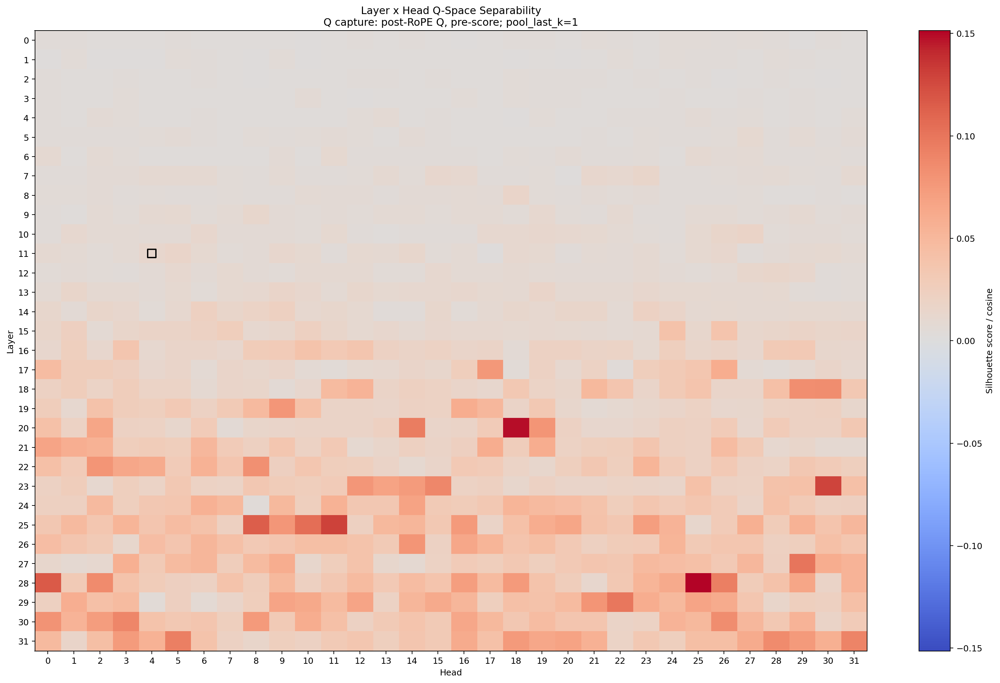
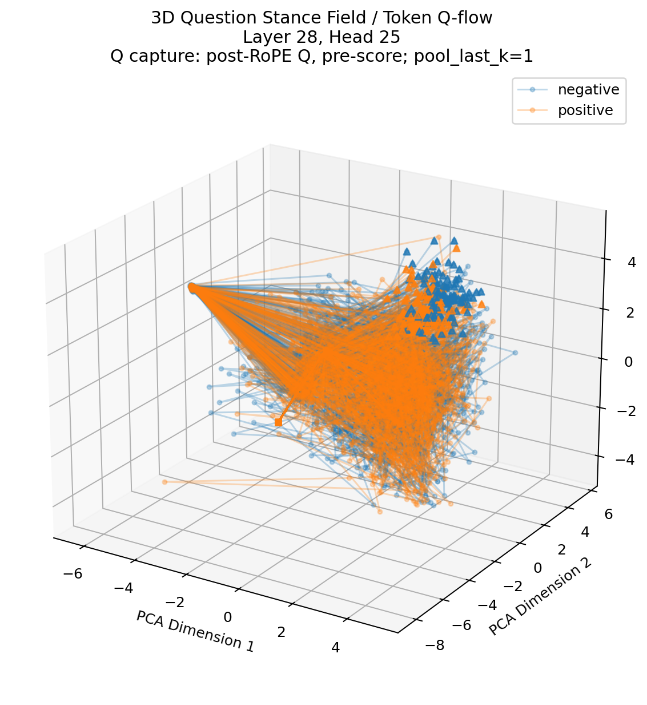
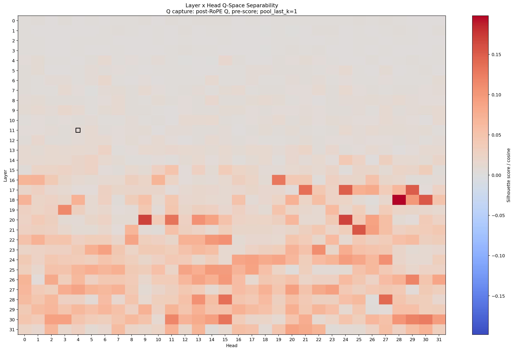
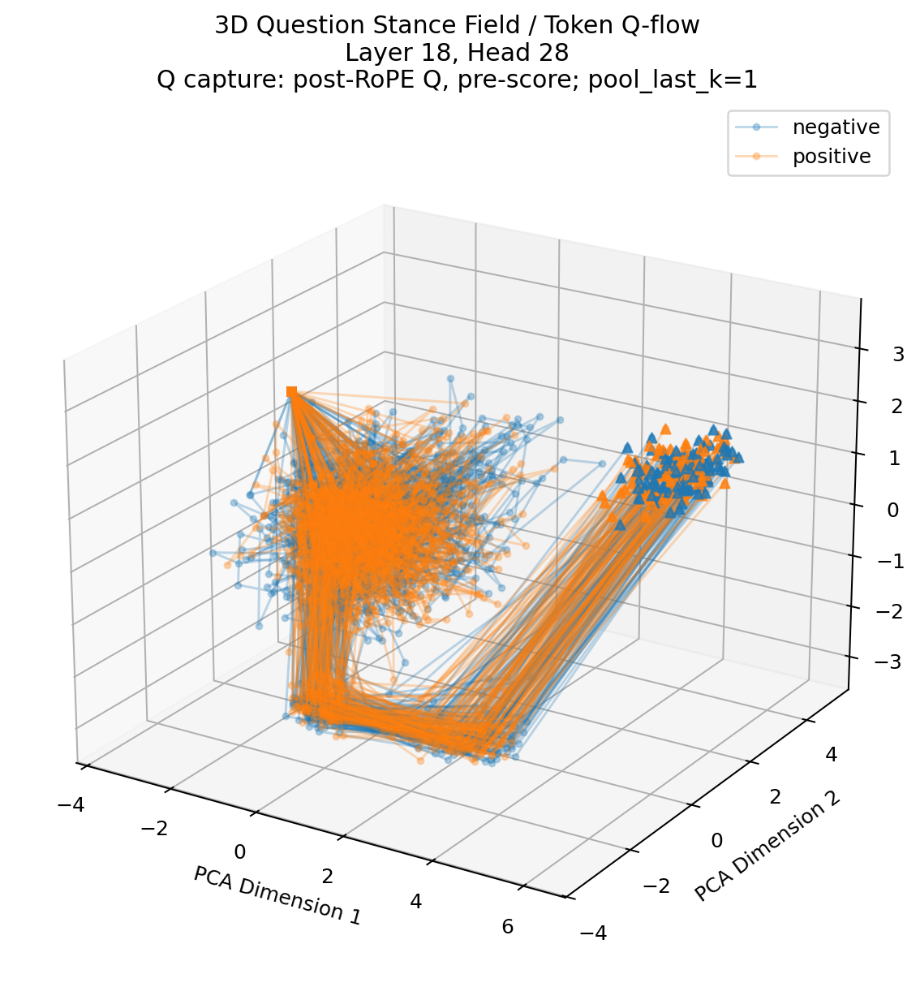
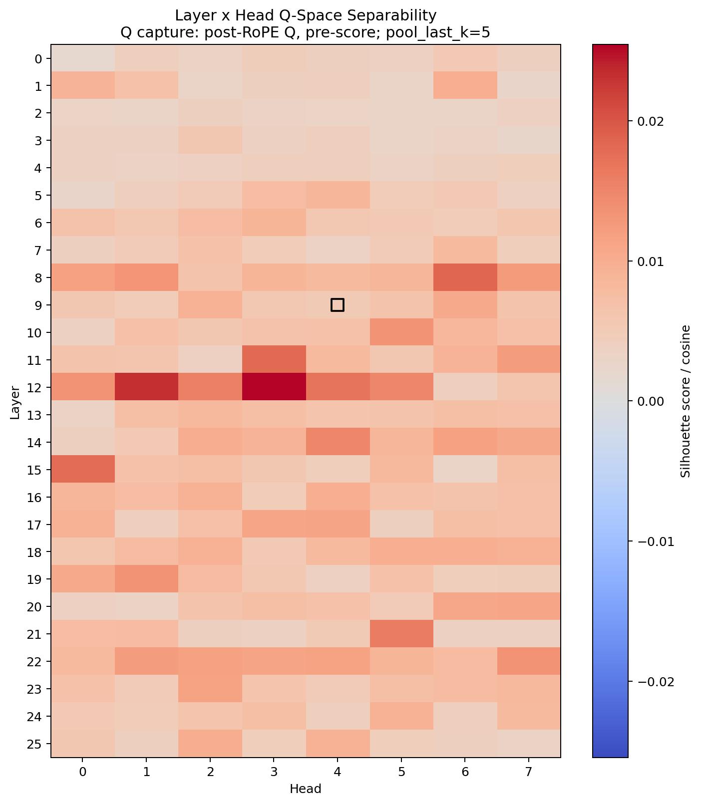

# N=1000/Class 3D Base-vs-Instruct Matrix

Date: 2026-05-25

This note records the first larger 3D plotting pass across the current
Mistral, Llama 3, and Gemma 2 2B model matrix.

The run is no longer a toy-scale probe. Each model sees `1000` examples per
class, or `2000` rows per model. With six model configurations, each dataset
produces `12000` model-sample Q observations before layer/head expansion. In
conversation shorthand this was called the "n=6000" run because it is six model
configs at `1000/class`; the concrete per-model sample count in the CSVs is
`2000`.

Raw compact tables are in:

- `examples/n1000_3d_matrix/subj_n1000_3d_batch_top_layer_heads.csv`
- `examples/n1000_3d_matrix/subj_n1000_3d_batch_model_summary.csv`
- `examples/n1000_3d_matrix/sst2_prompted_n1000_3d_pool_last_k_sweep_summary.csv`
- `examples/n1000_3d_matrix/sst2_prompted_n1000_3d_pool_last_k_sweep_manifest.json`
- `examples/n1000_3d_matrix/subj_n1000_3d_post_rope_headline_summary.csv`
- `examples/n1000_3d_matrix/sst2_prompted_n1000_3d_post_rope_pool_last_k_sweep_summary.csv`
- `examples/n1000_3d_matrix/sst2_prompted_n1000_3d_post_rope_pool_last_k_sweep_manifest.json`
- `examples/n1000_3d_matrix/n1000_3d_pre_post_headline_comparison.csv`

Large full outputs, including per-model 3D plots and `q_space_vectors.npz`, were
left under `/tmp` or `~/q_space_runs` and are not tracked in the repository.
The SUBJ post-RoPE full `/tmp` artifact was not retained, so its tracked table
is a headline summary reconstructed from the terminal run summary.

## Common Settings

- backend: MLX
- model precision: current `mlx-community/*-4bit` checkpoints
- Q capture: pre-RoPE Q projection output
- projection: PCA
- plots: `--plot-3d`
- plot density control: `--plot-sample-limit 200`
- final-token robustness: `--pool-last-k-sweep 1,3,5` for prompted SST-2
- token handling: `--drop-special-tokens`, `--flow-start-token-index 1`
- controls: label permutation, high-dimensional flow metrics, projection
  diagnostics, linear probe, and head similarity
- large-run speed knob used in the first pass: `--linear-probe-permutation-n 0`

`--plot-sample-limit 200` only sparsifies all-sample trajectory and token-flow
plots. Silhouette scores, probes, CSV metrics, and summaries still use the full
captured sample.

For claim-facing reruns, use at least `--linear-probe-permutation-n 50` and keep
`--label-permutation-n` positive so the headline silhouette rows carry
random-label null statistics.

## SUBJ Base-vs-Instruct

Dataset:

- source: `SetFit/subj`
- split: `train`
- sample: `1000 subjective + 1000 objective`

Best layer/head by high-dimensional cosine silhouette:

| model | best layer/head | relative depth | silhouette |
| --- | ---: | ---: | ---: |
| Mistral-7B base | L10/H6 | 0.323 | 0.2270 |
| Mistral-7B instruct | L7/H15 | 0.226 | 0.2154 |
| Llama-3-8B base | L11/H6 | 0.355 | 0.1758 |
| Llama-3-8B instruct | L20/H31 | 0.645 | 0.2187 |
| Gemma-2-2B base | L21/H4 | 0.840 | 0.1663 |
| Gemma-2-2B-it | L1/H0 | 0.040 | 0.0345 |

### SUBJ Interpretation

The qualitative base-vs-instruct story survives the larger sample.

**Mistral remains stable but less single-head pinned.** The base model still
peaks around early/mid depth at L10/H6. The instruction-tuned model's top head
moves to L7/H15 at this sample size, but the earlier L11/H22 head remains near
the top. The important pattern is therefore not one magic head, but a stable
early/mid stance-separating band.

**Llama 3 still migrates deeper under instruction tuning.** The base model peaks
near L11/H6, while the instruction-tuned model peaks at L20/H31. This preserves
the earlier observation that Llama 3's strongest SUBJ stance geometry appears
later after instruction tuning.

**Gemma 2 2B is the sharp contrast case.** The base model has a late usable
single-head axis at L21/H4. The instruction-tuned model shows a weak early
maximum at L1/H0, with top rows tightly clustered near zero. The N=1000 top five
are L1/H0 `0.0345`, L5/H3 `0.0320`, L12/H1 `0.0295`, L3/H1 `0.0269`, and L5/H2
`0.0269`. Because these values are close, the apparent best-head jump from the
earlier N=100 run should be read as rank instability inside a flat/diffuse
surface, not as evidence that the model moved a strong signal to a new head.

## Prompted SST-2 Base-vs-Instruct

Dataset:

- source: SST-2
- split: `train`
- sample: `1000 negative + 1000 positive`
- template: `Review: {text}\nSentiment:`

Best layer/head by high-dimensional cosine silhouette:

| model | pool_last_k | best layer/head | relative depth | silhouette |
| --- | ---: | ---: | ---: | ---: |
| Mistral-7B base | 1 | L28/H25 | 0.903 | 0.0745 |
| Mistral-7B base | 3 | L10/H21 | 0.323 | 0.0718 |
| Mistral-7B base | 5 | L10/H21 | 0.323 | 0.0978 |
| Mistral-7B instruct | 1 | L23/H30 | 0.742 | 0.1726 |
| Mistral-7B instruct | 3 | L20/H18 | 0.645 | 0.1082 |
| Mistral-7B instruct | 5 | L10/H21 | 0.323 | 0.0974 |
| Llama-3-8B base | 1 | L20/H24 | 0.645 | 0.1205 |
| Llama-3-8B base | 3 | L20/H24 | 0.645 | 0.0834 |
| Llama-3-8B base | 5 | L8/H15 | 0.258 | 0.0766 |
| Llama-3-8B instruct | 1 | L18/H28 | 0.581 | 0.2246 |
| Llama-3-8B instruct | 3 | L20/H9 | 0.645 | 0.1376 |
| Llama-3-8B instruct | 5 | L8/H15 | 0.258 | 0.1041 |
| Gemma-2-2B base | 1 | L22/H1 | 0.880 | 0.0333 |
| Gemma-2-2B base | 3 | L12/H4 | 0.480 | 0.0439 |
| Gemma-2-2B base | 5 | L12/H4 | 0.480 | 0.0587 |
| Gemma-2-2B-it | 1 | L1/H6 | 0.040 | 0.0127 |
| Gemma-2-2B-it | 3 | L12/H1 | 0.480 | 0.0193 |
| Gemma-2-2B-it | 5 | L12/H3 | 0.480 | 0.0266 |

### SST-2 Interpretation

Prompted SST-2 is not as clean as SUBJ, but it is structured rather than flat.

**Instruction tuning is associated with stronger prompted sentiment stance in
Mistral and Llama 3.** With `pool_last_k=1`, Mistral-7B-Instruct rises to
L23/H30 at `0.1726`, while Llama-3-8B-Instruct rises to L18/H28 at `0.2246`.
These are substantially stronger than the matching base checkpoints and much
stronger than Gemma 2 2B-it. This is confounded with prompt-following and
instruction-format competence, because the template explicitly creates a
`Sentiment:` query position.

**Pooling changes the readout position.** `pool_last_k=1` emphasizes the final
task cue position in `Review: ... Sentiment:`. Pooling over `3` or `5` tokens
mixes the cue with nearby text positions, and the best layer/head can move from
late to mid or early/mid depth. This is not a failure of the probe; it says the
Q-space stance is position-sensitive.

**Llama 3's prompted IT signal remains strongest.** The exact best head changes
from the earlier 100/class run, but the family-level result survives: Llama 3
IT has a strong late/mid prompted polarity head, with L20/H9 reappearing when
`pool_last_k=3`.

**Gemma 2 2B stays weak, especially after instruction tuning.** Gemma base
improves slightly as pooling widens, reaching L12/H4 at `0.0587`.
Gemma 2 2B-it stays near zero across the sweep. Again, this should be phrased
as weak single-head localization, not proof that the model lacks polarity
information.

## Cross-Dataset Pattern

The larger run sharpens the matrix:

```text
SUBJ:
  Mistral stable early/mid band
  Llama 3 deeper after instruction tuning
  Gemma 2 2B base late, Gemma 2 2B-it flat/diffuse

Prompted SST-2:
  Mistral IT and Llama 3 IT light up explicit sentiment-query heads
  pooling changes the measured stance position
  Gemma 2 2B-it remains the weak/localization-negative contrast
```

The peak location and strength vary with family, tuning state, task framing, and
token pooling. This is useful structure, but not by itself a proof against all
artifacts. The stronger sanity checks are the high-dimensional metric, random
label nulls, probe controls, and the separate pre/post-RoPE observation that the
signal can survive rotary position phase while reorganizing.

## Post-RoPE 4bit Rerun

Before moving to dense checkpoints, the same six 4bit configurations were rerun
with:

```text
--q-capture-stage post-rope
```

The result is no longer just the small Mistral pilot: across both SUBJ and
prompted SST-2, the main signal survives after RoPE. Some headline rows are
lower or shifted after RoPE, but those deltas should be treated as single-run
variation until reproduced across seeds or repeated samples.



### SUBJ Post-RoPE

| model | post-RoPE best layer/head | relative depth | silhouette |
| --- | ---: | ---: | ---: |
| Mistral-7B base | L10/H6 | 0.323 | 0.2245 |
| Mistral-7B instruct | L10/H6 | 0.323 | 0.2102 |
| Llama-3-8B base | L5/H1 | 0.161 | 0.1695 |
| Llama-3-8B instruct | L20/H31 | 0.645 | 0.2010 |
| Gemma-2-2B base | L15/H0 | 0.600 | 0.1528 |
| Gemma-2-2B-it | L12/H1 | 0.480 | 0.0286 |

The important point is not exact head identity. The band-level story survives:

- Mistral remains an early/mid stance band, with base `L10/H6` essentially
  unchanged and instruct moving to the same local band.
- Llama 3 instruct preserves the late `L20/H31` readout after RoPE.
- Gemma 2 2B base remains nonzero but weaker, while Gemma 2 2B-it remains
  weakly localized.

### Prompted SST-2 Post-RoPE

Strongest row per model across `pool_last_k=1,3,5`:

| model | strongest post-RoPE row | silhouette | pre-RoPE strongest |
| --- | ---: | ---: | ---: |
| Mistral-7B base | k=1 L28/H25 | 0.0676 | k=5 L10/H21, 0.0978 |
| Mistral-7B instruct | k=1 L28/H25 | 0.1514 | k=1 L23/H30, 0.1726 |
| Llama-3-8B base | k=1 L20/H24 | 0.1119 | k=1 L20/H24, 0.1205 |
| Llama-3-8B instruct | k=1 L18/H28 | 0.1980 | k=1 L18/H28, 0.2246 |
| Gemma-2-2B base | k=5 L14/H7 | 0.0382 | k=5 L12/H4, 0.0587 |
| Gemma-2-2B-it | k=5 L12/H3 | 0.0255 | k=5 L12/H3, 0.0266 |

All post-RoPE prompted SST-2 headline rows beat their random-label silhouette
nulls at the 200-permutation p-value floor (`p = 1 / 201`). The z-scores are
large because `N=2000` makes the null standard deviations very small, so p-value
and raw silhouette should be treated as the primary quantities.

Representative post-RoPE prompted SST-2 plots:











### Pre/Post-RoPE Reading

The compact reading now becomes:

```text
headline task signal: usually present both pre-RoPE and post-RoPE
small score/head shifts: single-run variation until reproduced
```

This matters for claim hygiene. The earlier Mistral-IT N=100 pilot suggested a
"weaker, broader, later" post-RoPE readout, but that phrase should not be used
as the cross-family headline. The N=1000 matrix is better summarized as:

```text
Q-space task signals are largely preserved across the pre/post-RoPE capture
surface at headline level, while exact score differences and head identities
need reproduction before interpretation.
```

In particular, notes such as "Gemma appears more RoPE-sensitive", "Llama 3
Instruct looks stronger pre-RoPE", or "Mistral looks more robust" are useful
prompts for future experiments, not established trends here. The observed
differences are often on the order of a few hundredths of silhouette, sometimes
near the noise floor of the task, and the matrix still uses one sample seed.

## Reproduction Commands

SUBJ:

```bash
./q_space_manifold_monolith.py \
  --dataset-source subj \
  --dataset-split train \
  --samples-per-class 1000 \
  --batch-models mistral_base=mlx:mlx-community/Mistral-7B-v0.3-4bit,mistral_it=mlx:mlx-community/Mistral-7B-Instruct-v0.3-4bit,llama3_base=mlx:mlx-community/Meta-Llama-3-8B-4bit,llama3_it=mlx:mlx-community/Meta-Llama-3-8B-Instruct-4bit,gemma2_2b_base=mlx:mlx-community/gemma-2-2b-4bit,gemma2_2b_it=mlx:mlx-community/gemma-2-2b-it-4bit \
  --target-layer-fraction 0.35 \
  --target-head 4 \
  --projection pca \
  --detail-best-layer-head \
  --label-permutation-n 200 \
  --high-d-flow-metrics \
  --projection-diagnostics \
  --probe-linear \
  --linear-probe-permutation-n 50 \
  --head-similarity \
  --drop-special-tokens \
  --flow-start-token-index 1 \
  --plot-3d \
  --plot-sample-limit 200 \
  --output-dir /tmp/q_space_subj_n1000_base_vs_it_3d
```

Prompted SST-2:

```bash
./q_space_manifold_monolith.py \
  --dataset-source sst2 \
  --dataset-split train \
  --samples-per-class 1000 \
  --text-template $'Review: {text}\nSentiment:' \
  --batch-models mistral_base=mlx:mlx-community/Mistral-7B-v0.3-4bit,mistral_it=mlx:mlx-community/Mistral-7B-Instruct-v0.3-4bit,llama3_base=mlx:mlx-community/Meta-Llama-3-8B-4bit,llama3_it=mlx:mlx-community/Meta-Llama-3-8B-Instruct-4bit,gemma2_2b_base=mlx:mlx-community/gemma-2-2b-4bit,gemma2_2b_it=mlx:mlx-community/gemma-2-2b-it-4bit \
  --target-layer-fraction 0.35 \
  --target-head 4 \
  --pool-last-k-sweep 1,3,5 \
  --projection pca \
  --detail-best-layer-head \
  --label-permutation-n 200 \
  --high-d-flow-metrics \
  --projection-diagnostics \
  --probe-linear \
  --linear-probe-permutation-n 50 \
  --head-similarity \
  --drop-special-tokens \
  --flow-start-token-index 1 \
  --plot-3d \
  --plot-sample-limit 200 \
  --output-dir /tmp/q_space_sst2_prompted_n1000_base_vs_it_3d
```

## Next Matrix: Dense Same-Family Check

The 4bit pre/post-RoPE matrix is now strong enough to hand off to dense
checkpoints. Repeat this matrix on a larger MacBook Pro with dense checkpoints
from the same families. That gives a clean 12-cell comparison per capture
stage:

```text
3 families x 2 tuning states x 2 task framings
```

The key question is whether the current 4bit findings are architecture-level
and tuning-level effects, or whether some of the observed flattening and peak
movement is partly quantization-sensitive.

The dense run should reuse the same analysis flags, including:

```text
--samples-per-class 1000
--projection pca
--detail-best-layer-head
--label-permutation-n 200
--probe-linear
--linear-probe-permutation-n 50
--head-similarity
--plot-3d
--plot-sample-limit 200
--drop-special-tokens
--flow-start-token-index 1
```

Run both default pre-RoPE and post-RoPE variants when feasible:

```text
--q-capture-stage pre-rope
--q-capture-stage post-rope
```

The model IDs should be resolved on the target machine before download. The
important thing is to keep family, tuning state, dataset, prompt template, and
pooling identical to this run.

## Caveats

- Silhouette is still correlational and is computed in original Q-space, not in
  the 3D projection.
- 3D plots reduce visual overplotting, but they do not change the metric.
- Prompted SST-2 measures a classification stance induced by a task cue, not
  generic review semantics; prompt-following competence is a live confound.
- `pool_last_k` changes the token position being measured; it is an
  experimental factor, not just a smoothing trick.
- Specific head IDs are less stable than local bands. Treat top-head changes
  across N=100 and N=1000 as a reason to prefer band-level claims unless a head
  survives across sample size, pooling, capture stage, and task framing.
- SUBJ is a two-class silhouette measurement. A future sanity check should
  report an empirical ceiling or easy-baseline bound before interpreting score
  magnitudes too literally.
- Dense follow-up is required before claiming the pattern is independent of
  quantization.
