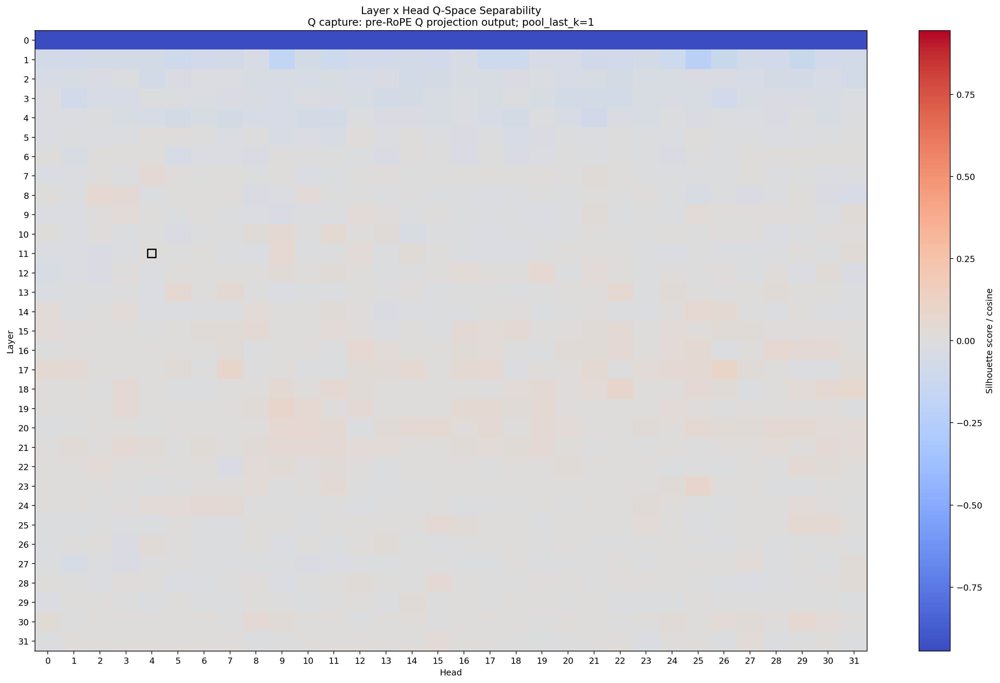
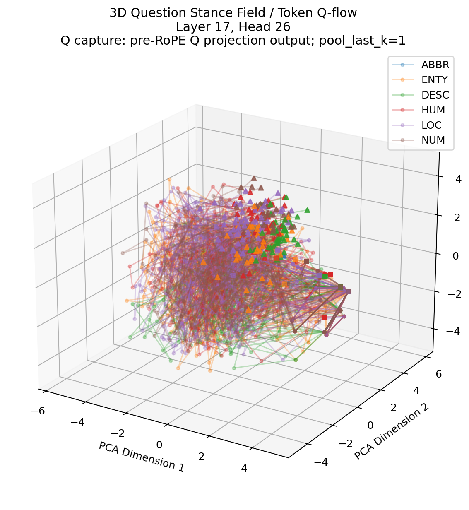
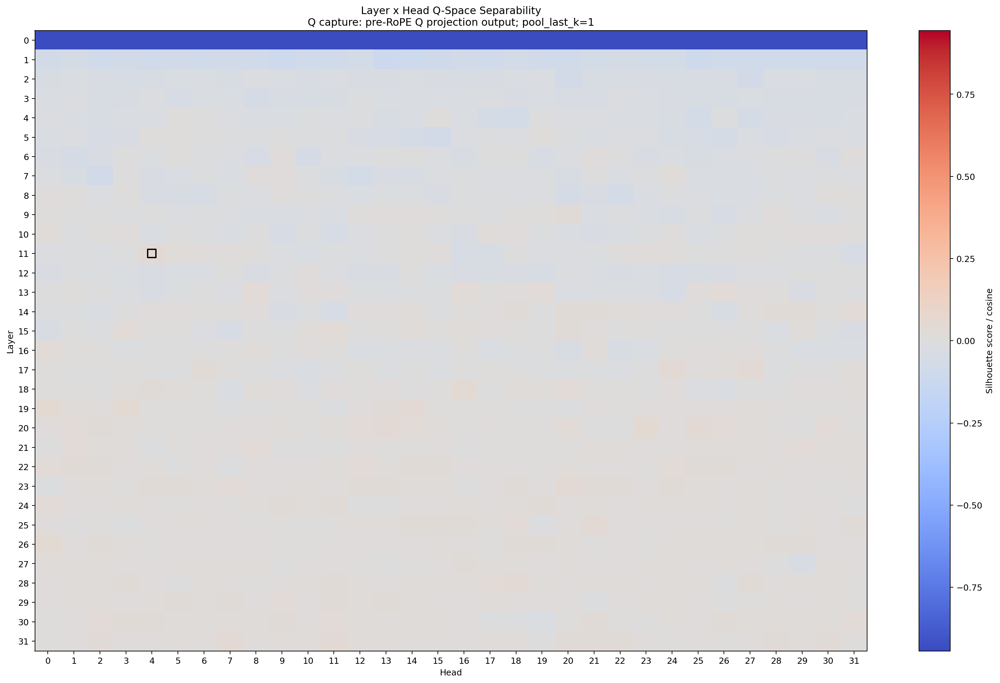
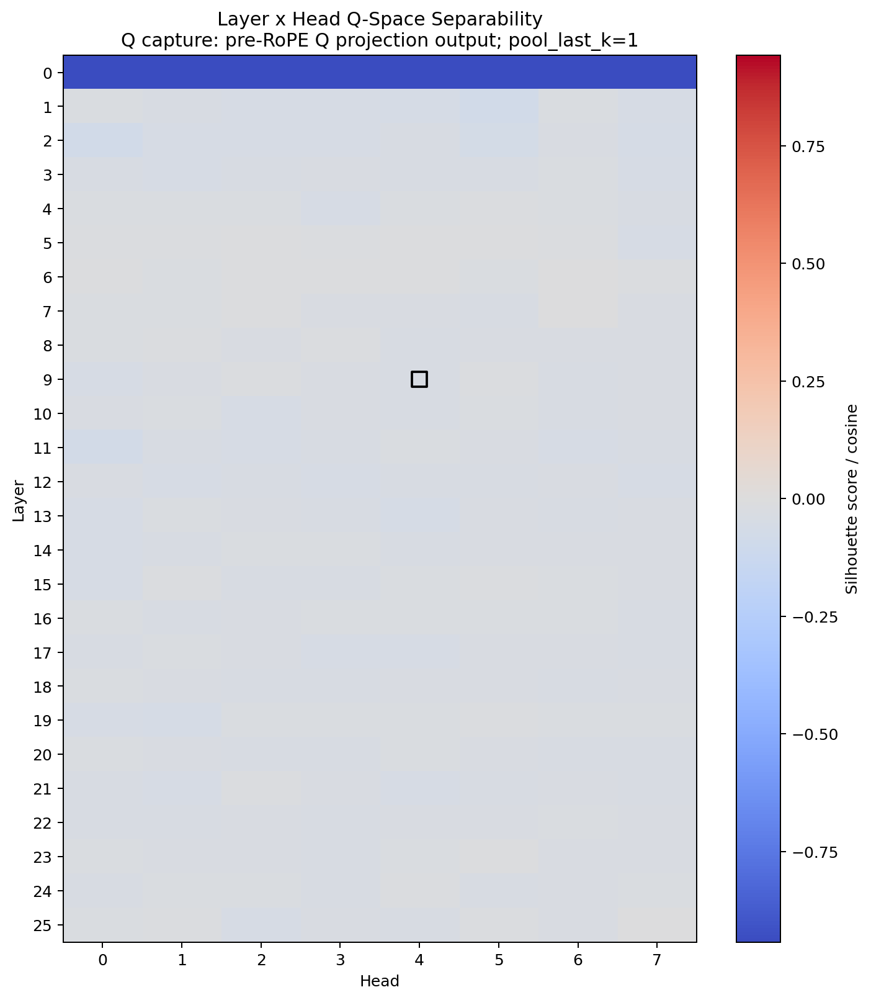

# TREC Question-Type Pre-RoPE Sweep

Date: 2026-05-31

This note records the first TREC coarse question-type sweep across the current
six 4bit base/instruction-tuned model configurations.

The motivating question is slightly different from SUBJ or SST-2. TREC asks
whether final-token Q geometry carries the model's answer-type search posture:
abbreviation, entity, description, human, location, or numeric answer.

Compact tracked artifacts:

- `examples/trec_coarse_pre_rope_n1000ish/pool_last_k_sweep_summary.csv`
- `examples/trec_coarse_pre_rope_n1000ish/best_per_model_summary.csv`
- `examples/trec_coarse_pre_rope_n1000ish/class_sampling_summary.csv`
- `examples/trec_coarse_pre_rope_n1000ish/abbr_excluded_original_best_silhouette.csv`
- `examples/trec_coarse_pre_rope_n1000ish/pool_last_k_sweep_manifest.json`

Large full outputs, including `q_space_vectors.npz`, were left under
`~/q_space_runs/trec_coarse_n1000ish_base_vs_it_3d_pre_rope` and are not
tracked in this repository.

## Settings

- dataset: `omkar334/trec`
- split: `train`
- label: `coarse_label`
- classes: `ABBR`, `ENTY`, `DESC`, `HUM`, `LOC`, `NUM`
- requested sample cap: `--samples-per-class 1000`
- actual sample count per model: `4817`
- backend: MLX
- models: Mistral-7B base/instruct, Llama-3-8B base/instruct, Gemma-2-2B
  base/instruct, all current `mlx-community/*-4bit` checkpoints
- Q capture: pre-RoPE Q projection output
- projection: PCA
- plots: `--plot-3d --plot-sample-limit 200`
- pooling: `--pool-last-k-sweep 1,3,5`
- controls: 200 silhouette label permutations, 50 linear-probe label
  permutations, projection diagnostics, high-dimensional flow metrics, and
  head RSA/CKA

The run is called `n1000ish`, not `n1000/class`, because the full TREC coarse
training distribution is imbalanced. With a cap of 1000 per class, the observed
sample count is:

```text
ABBR 86 + ENTY 1000 + DESC 1000 + HUM 1000 + LOC 835 + NUM 896 = 4817
```

This matters because the `ABBR` class has only 86 examples, while the largest
classes are capped at 1000. The headline six-class silhouette should therefore
be read as a capped-balanced TREC coarse score, not as a strictly balanced
six-class estimate.

### Sampling Procedure

The script loads the dataset once before entering the batch-model and
`pool_last_k` loops. Therefore all six models and all three pooling values in
this command see the same selected `4817` rows.

Selection used the repository's `balanced_or_limited_rows()` helper:

```text
for each class:
  shuffle rows with random_state 42
  take min(--samples-per-class, class_count)
```

There is no upsampling, class weighting, or replacement sampling. Classes below
the cap are kept in full; classes above the cap are randomly capped at 1000.

| label id | class | original train count | selected count | policy |
| ---: | --- | ---: | ---: | --- |
| 0 | ABBR | 86 | 86 | keep all |
| 1 | ENTY | 1250 | 1000 | sample 1000 |
| 2 | DESC | 1162 | 1000 | sample 1000 |
| 3 | HUM | 1223 | 1000 | sample 1000 |
| 4 | LOC | 835 | 835 | keep all |
| 5 | NUM | 896 | 896 | keep all |

The matching post-RoPE command should use the same dataset arguments and seed
to make the selected rows comparable. For claim-facing reruns, prefer passing
`--dataset-seed 42` explicitly and checking `dataset_rows.csv` when comparing
pre/post outputs.

## Best Rows

Best layer/head by high-dimensional cosine silhouette across the
`pool_last_k=1,3,5` sweep:

| model | pool_last_k | best layer/head | relative depth | silhouette | probe macro acc |
| --- | ---: | ---: | ---: | ---: | ---: |
| Mistral-7B base | 1 | L17/H26 | 0.548 | 0.1019 | 0.8390 |
| Mistral-7B instruct | 1 | L17/H26 | 0.548 | 0.0795 | 0.8379 |
| Llama-3-8B base | 1 | L17/H24 | 0.548 | 0.0595 | 0.8072 |
| Llama-3-8B instruct | 1 | L18/H16 | 0.581 | 0.0475 | 0.8277 |
| Gemma-2-2B base | 1 | L17/H3 | 0.680 | 0.0816 | 0.8807 |
| Gemma-2-2B-it | 3 | L6/H6 | 0.240 | 0.0003 | 0.6949 |

All listed best rows beat their 200-permutation silhouette null at the p-value
floor (`p = 1 / 201`), but the raw silhouette values remain modest. This is a
useful distinction: TREC question type appears linearly readable from Q-space,
but not necessarily as a clean six-cluster manifold.

## ABBR-Imbalance Check

Because `ABBR` contributes only 86 rows, a small follow-up recomputed
silhouette after dropping `ABBR` and keeping `ENTY`, `DESC`, `HUM`, `LOC`, and
`NUM` (`4731` rows total). This is not a full five-class layer/head rescan; it
reuses each original six-class best layer/head and asks whether the headline
score collapses when the smallest class is removed.

| model | pool_last_k | original six-class best | six-class sil | five-class sil at same head |
| --- | ---: | ---: | ---: | ---: |
| Mistral-7B base | 1 | L17/H26 | 0.1019 | 0.1132 |
| Mistral-7B instruct | 1 | L17/H26 | 0.0795 | 0.1049 |
| Llama-3-8B base | 1 | L17/H24 | 0.0595 | 0.0670 |
| Llama-3-8B instruct | 1 | L18/H16 | 0.0475 | 0.0495 |
| Gemma-2-2B base | 1 | L17/H3 | 0.0816 | 0.0901 |
| Gemma-2-2B-it | 3 | L6/H6 | 0.0003 | 0.0162 |

The five-class scores do not erase the headline readout, and in most cases they
increase slightly. The safer interpretation is that `ABBR` imbalance is a real
caveat for comparing absolute six-class silhouette magnitudes, but the main
Mistral/Llama/Gemma contrast is not created solely by the tiny `ABBR` class.

## Pooling Pattern

The strongest row is almost always `pool_last_k=1`.

```text
mistral_base     k=1 L17/H26 score=0.1019
mistral_it       k=1 L17/H26 score=0.0795
llama3_base      k=1 L17/H24 score=0.0595
llama3_it        k=1 L18/H16 score=0.0475
gemma2_2b_base   k=1 L17/H3  score=0.0816
gemma2_2b_it     k=3 L6/H6   score=0.0003
```

This differs from some prompted SST-2 runs, where widening the final-token pool
can move the readout. In TREC, each row is already a question, and the final
token is usually the `?` position. The sharper `k=1` signal is therefore
consistent with a final query stance asking what kind of answer should be
retrieved next.

## Interpretation

The cleanest read is:

```text
TREC coarse pre-RoPE exposes an answer-type routing signal near the middle or
middle-late depth of several model families. It is more linearly readable than
visibly clustered.
```

Specific observations:

- **Mistral is very stable across base and instruction-tuned checkpoints.** Both
  models peak at `L17/H26`, with similar nearest-head neighborhoods. This is a
  stronger exact-head recurrence than the SUBJ and SST-2 larger runs.
- **Llama 3 lands nearby in depth but not in head identity.** Base peaks at
  `L17/H24`; instruction-tuned peaks at `L18/H16`. This looks more like a
  band-level recurrence than a fixed-head recurrence.
- **Gemma 2 2B base is readable, while Gemma 2 2B-it is not cleanly localized
  by silhouette.** The instruction-tuned Gemma row still has nontrivial linear
  probe accuracy, so the cautious phrasing is "weak single-head manifold
  localization", not "absence of question-type information."
- **TREC is not SUBJ with different labels.** SUBJ can form visually separable
  subjectivity/objectivity geometry. TREC has six answer-type axes and class
  imbalance; it behaves more like a multi-axis routing code that a linear probe
  can decode.

## Head Similarity Around Best Heads

Best-head similarity to other heads in the same layer:

| model | best head | mean CKA | mean RSA | nearest heads by CKA |
| --- | ---: | ---: | ---: | --- |
| Mistral-7B base | L17/H26 | 0.671 | 0.627 | H25, H7, H17, H24, H21 |
| Mistral-7B instruct | L17/H26 | 0.678 | 0.630 | H25, H17, H7, H24, H14 |
| Llama-3-8B base | L17/H24 | 0.577 | 0.581 | H27, H6, H26, H29, H12 |
| Llama-3-8B instruct | L18/H16 | 0.654 | 0.707 | H18, H22, H20, H31, H23 |
| Gemma-2-2B base | L17/H3 | 0.713 | 0.746 | H4, H6, H2, H0, H7 |
| Gemma-2-2B-it | L6/H6 | 0.640 | 0.632 | H5, H4, H0, H7, H2 |

The Mistral base/IT recurrence is especially useful: the same best head and a
similar local neighborhood appear across tuning state. Llama 3 is less exact
but remains in a nearby depth band. Gemma 2 2B-it is the contrast case, where
classification remains decodable but the manifold score is essentially flat.

## Representative Plots

Mistral base TREC pre-RoPE heatmap:



Mistral base best-head token Q-flow:



Llama 3 instruct TREC pre-RoPE heatmap:



Gemma 2 2B-it TREC pre-RoPE heatmap:



## Reproduction

```bash
MODELS='mistral_base=mlx:mlx-community/Mistral-7B-v0.3-4bit,mistral_it=mlx:mlx-community/Mistral-7B-Instruct-v0.3-4bit,llama3_base=mlx:mlx-community/Meta-Llama-3-8B-4bit,llama3_it=mlx:mlx-community/Meta-Llama-3-8B-Instruct-4bit,gemma2_2b_base=mlx:mlx-community/gemma-2-2b-4bit,gemma2_2b_it=mlx:mlx-community/gemma-2-2b-it-4bit'

./q_space_manifold_monolith.py \
  --dataset-source hf \
  --hf-dataset-name omkar334/trec \
  --dataset-split train \
  --text-column text \
  --label-column coarse_label \
  --samples-per-class 1000 \
  --batch-models "$MODELS" \
  --pool-last-k-sweep 1,3,5 \
  --q-capture-stage pre-rope \
  --target-layer-fraction 0.35 \
  --target-head 4 \
  --projection pca \
  --detail-best-layer-head \
  --label-permutation-n 200 \
  --linear-probe-permutation-n 50 \
  --probe-linear \
  --high-d-flow-metrics \
  --projection-diagnostics \
  --head-similarity \
  --drop-special-tokens \
  --flow-start-token-index 1 \
  --plot-3d \
  --plot-sample-limit 200 \
  --resume-existing \
  --output-dir ~/q_space_runs/trec_coarse_n1000ish_base_vs_it_3d_pre_rope
```

`--resume-existing` is included because this sweep stores a large per-model
token-Q bundle while reusing it across pool values. If the process is
interrupted, completed `pool_last_k/model` directories can be reused instead of
starting from the beginning.

## Caveats

- This is still pre-RoPE only. The matching post-RoPE TREC sweep is needed
  before comparing against the broader pre/post matrix.
- The six-way label structure makes silhouette smaller and harder to compare
  directly to two-class SUBJ or SST-2.
- The probe accuracy is strong, but it is still predictive evidence, not causal
  evidence.
- `ABBR`, `LOC`, and `NUM` are below 1000 examples in the training split, so
  the run is capped-balanced rather than exactly balanced.
